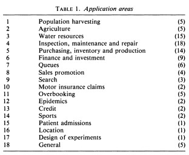

# Optimizing-Warehouse-Flows-with-Q-Learning
Calculate the optimum route of a robot in a warehouse using Q-Learning algorithm (Bellman equation)

# Description
This notebook shows how to calculate the optimal route of a robot in a warehouse. The robot must go from a starting location to a target location. The algorithm uses Q-Learning recursive principle to calculate the optimal sequence to reach target.
The algorithm can be easily modified to specify intermediate stops. The robot must foctor these in, as constraints, and still find the optimal route.

# Q-learning algorithm
The optimization is performed using Bellman's equation which is cornerstone to the Reinforcement learning AI field.
This equation allows to calculate the value of each action as a function of future actions. The value of an action is decomposed into an immediate reward for the action (the mouvement allowing to go from one location to the next) and the discounted value of the future actions following.
As part of the learning process, the agent will iterate multiple times exploring the environment, allowing to recursively compute the value of all actions (the Q-Values).
These values will ultimately converge, allowing to determine the optimal route given a starting and ending points.

This is a simple illustration of the potential behind Bellman equation. I covered a more complicated problem in this project [Minimize-Energy-consumption-with-Deep-Learning-model](https://github.com/LaurentVeyssier/Minimize-Energy-consumption-with-Deep-Learning-model). I also applied these principles to another business related situation in this [princing optimization project](https://github.com/LaurentVeyssier/Pricing-optimization-Model).

Applications are numourous. A few are described in this paper [A survey of applications of Markov Decision Processes](https://www.jstor.org/stable/2583870?origin=JSTOR-pdf&seq=1) from D.J. White.

# Algorithm steps
1- Define the environment : the states (the different possible locations here), the actions (allwoing to transit from one location to the next here), the rewards for each tuple (location x action)
2- Calculate Q-values usign multiple iterations with random action selection while exploring the environment. The objective is to calculate the value of each possible actions given a state (location). The algorithm works as follows:
- select a location at random
- list all possible actions (transition to another location) and pick one at random. The selected action allows to determine the enxt location taken by the robot.
- calculate the Temporal Difference in that time step: TD = Immediate rewards from the selected action + discount rate x maximum value of all possible actions in the next location
- Update the Q-value for the tuple (location, action) by adding the temporal difference
- repeat over multiple iterations (1000).
3- Use the Q-Value matrix now available to determine the optimal route from a starting location to a target location. This is achieved by allowting a big reward to the target location, determining the matrix of Q-values through iterations of the agent (exploration). Then we just follow the maximum value of the possible actions at each location iteratively. The action with the highest value indicates the transition to next location, and so on and so forth, until the optimal route is determined step-by-step.

